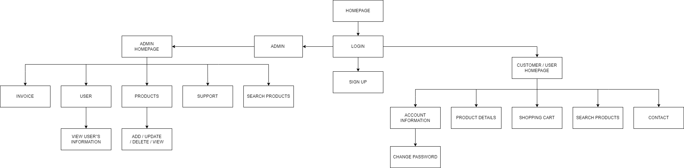
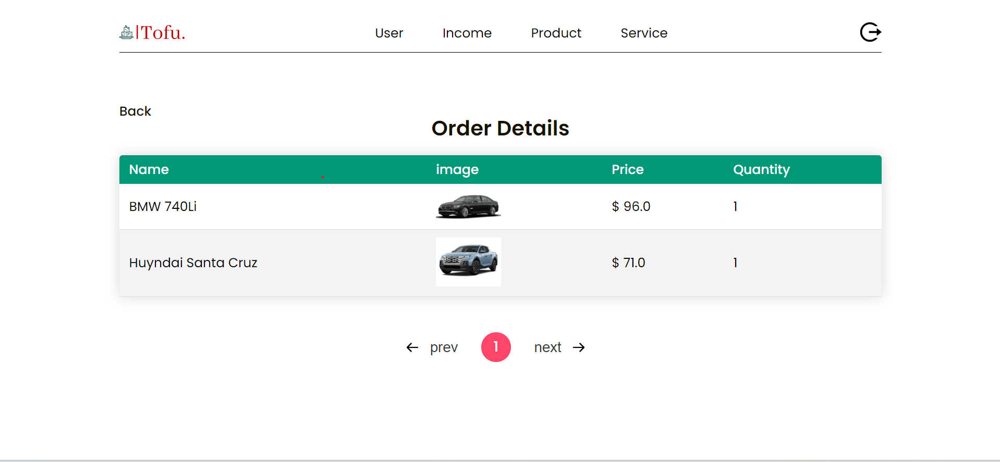

# TOFU shop

## TOFU group (08)

35_ Nguyễn Minh Thư (SE183335)  
34_ An Phúc Hòa (SE183311)  
33_ Lê Hoàng Minh (SE182315)

## 1.REQUIREMENTS 
* **Name of system:** TOFU
 
* **Purpose:** Tofu's website offers a range of functions aimed at simplifying the shopping experience for customers and enhancing the enjoyment for children. Our website provides a comprehensive selection of high-quality car toys, carefully curated to meet safety standards and encourage imaginative play. Each product listing includes detailed descriptions and customer reviews, empowering customers to make informed decisions about their purchases. Our transparent pricing ensures that customers know exactly what they're paying for, promoting trust and satisfaction. Moreover, our user-friendly interface facilitates effortless navigation and shopping, allowing customers to easily create accounts, manage their shopping carts, and view pricing information. Additionally, our platform includes a FAQ section to address common inquiries, ensuring that customers have access to the information they need

* **Object:** This system was created for the customers who is interested in our products, for the admin too. 

### Customers:
    
   *  REGISTER  : user can create a new account by creating username and password, their personal information like address, phone number, name.
    
   *  LOG IN/ LOG OUT  : users (customers) can log in a registered account and whenever they want, they can click "LOG OUT" to log out.

   *  SEARCH : they can search products by name and see those products clearly.

   *  VIEW : they can see the details of the products they are looking for (pictures, description, reviews), moreover , they can see MODEL and LATEST PRODUCTS.
   
   *  ACCOUNT INFORMATION : they can check their information and can change if something is wrong, especially they can also change their password.
   
   *  SHOPPING CART : user can add products and remove when they don't need to buy this item anymore, check the price of the order.
   
   *  CHECK OUT  : Users will see the amount they need to pay for each items they ordered and the total amount due for their final payment.   
   
   *  CONTACT : They can send an support requirement to the admin or leave messages about their experience with our products.
   
   *  CLIENT'S FEEDBACK : customers can give the feedback about the products or check what others thinks about the product that they are interested in.   
### Admin

  *  LOG IN/ LOG OUT  : Admin can log in with a separate account for admin to access to home page with salemanship's functions and log out when they are finished.

  *  PRODUCT  : Admin can manage the products (add, update, delete, view).
  
  *  CLIENT   : Admin can edit customers's information.

  *  INCOME  : They will have the final income based on the money that they get from all of the orders in a month / year, they can also check the order if it is successful. They can see the product in order details ( what type is it, the quantity, the color, note from customers ).

  *  SERVICE  : Admin can check for requirements from users.

## 2.WIREFRAME
### 2.1.Sitemap

### 2.2.Wireframe
#### USER
* Log in

* create account

* Homepage
  * Homepage header

  * Homepage content

  * Homepage footer 

* Shop

* Product details

* Account details

* Contact

* Shopping cart

* Checkout

#### Admin

## 3.DATABASE

## 4.SYSTEM DESIGN
* View

  
* Controller

  
* Model - DAO - DBUtils

  

## 5.CONCLUSION & DISCUSSION 
 
* **Pros:**
    + Clear layout, ensuring basic functionalities for an online shop website.
    + Pagination - displays products.
    + Send message to admin of the website.
    + Update and edit account information.
* **Cons:**
    + Security for admin is still a bit lax, anyone can log in if they have username and password.
    + Users can not check their order history.
    + There are not many different types of payment methods yet.
    + Do not use filter to catch errors and flexible in searching products.
### **What we learned:**
  - Applying MVC2 (Model-View-Controller) to develop the web application.
  - Work is clearly divided for each person:
    + Hòa: is in charge of coding the main interface design and some functions such as users, profile, featured, main page. Edit the final database.
    + Minh: Do login, register, shopping cart functions, insert information into the database.
    + Thư: Do the shop-page, featured products, slider functions, database. 
 - Learning how to research and troubleshoot errors effectively during the work process is essential for continuous improvement and problem-solving.
### **Improvement in Application:**
* Emphasizing more on web design techniques that deliver a better user experience.
* Enhancing the website's security to provide better protection.
* Learning and researching additional advanced features or incorporating missing functionalities into the developing website.
* Able to fix the above drawbacks.
* Apply more advanced features or framework (Spring, Hibernate,...)

